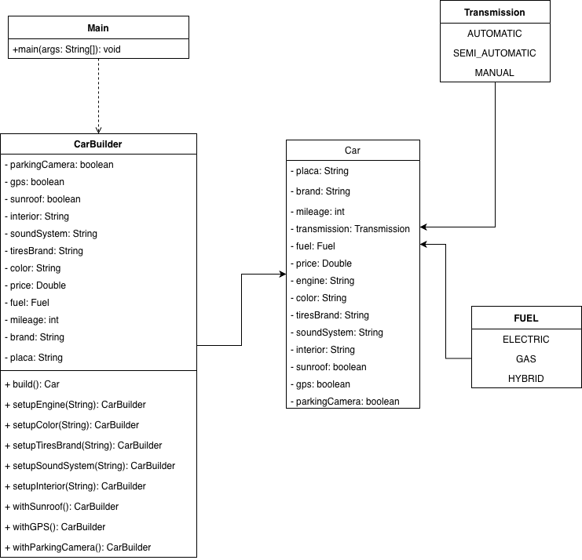

# Ejercicio 1 — Compañia automotriz

Imagina que estás desarrollando una aplicación para una compañía automotriz que permite
a los clientes personalizar y ordenar un automóvil. Un objeto Automóvil puede tener muchas
configuraciones opcionales: tipo de motor, color, llantas, sistema de sonido, interiores,
techo solar, navegación GPS, etc.

## Patrón que usamos

- **Tipo:** Creacional
- **Patrón:** Builder

## Por qué creacional

Los creacionales son para crear objetos. Los estructurales para cómo se organizan las clases. Los de comportamiento son para cómo se hablan cuando el programa ya está corriendo.

Al ser un caso de formar un objeto que puede tener multiples configuraciones se entiende que este escenario es creacional, no se van a organizar clases ni comportaminetos complejos con respecto al automovil 

## Por qué Builder
Al tener un sistema donde quieres ser detallado con las configuraciones de tu automovil builder ayuda a ser especifico en los subproductos del vehiculo al momento de la construccion de este.
 En especial en la parte de diferentes combinaciones de los parametros de dichos subproductos.

## Clases

| Clase         | Qué hace                                                                                                                                  |
|---------------|-------------------------------------------------------------------------------------------------------------------------------------------|
| `Car`         | Clase car donde tenemos los detalles de las propiedades del automovil                                                                     |
| `CarBuilder`  | Esta clase se encarga de separar las propiedades obligatorias y las opcionales al momento de configurar los detalles del vehiculo         |
| `Main`        | Prueba con BasicCar y moreComponentsCar para verificar al llamar la funcion build de que las nuevas especifiaciones del carro se lograron |

Cuando se llama la funcion build() esta nos traera un objetivo del tipo Car con los detalles del vehiculo.

## Cómo correrlo

```bash
mkdir -p target/classes
javac -d target/classes src/main/java/co/edu/upb/patrones/ejercicio1/*.java
java -cp target/classes co.edu.upb.patrones.ejercicio1.Main
```

## Diagrama de clases



