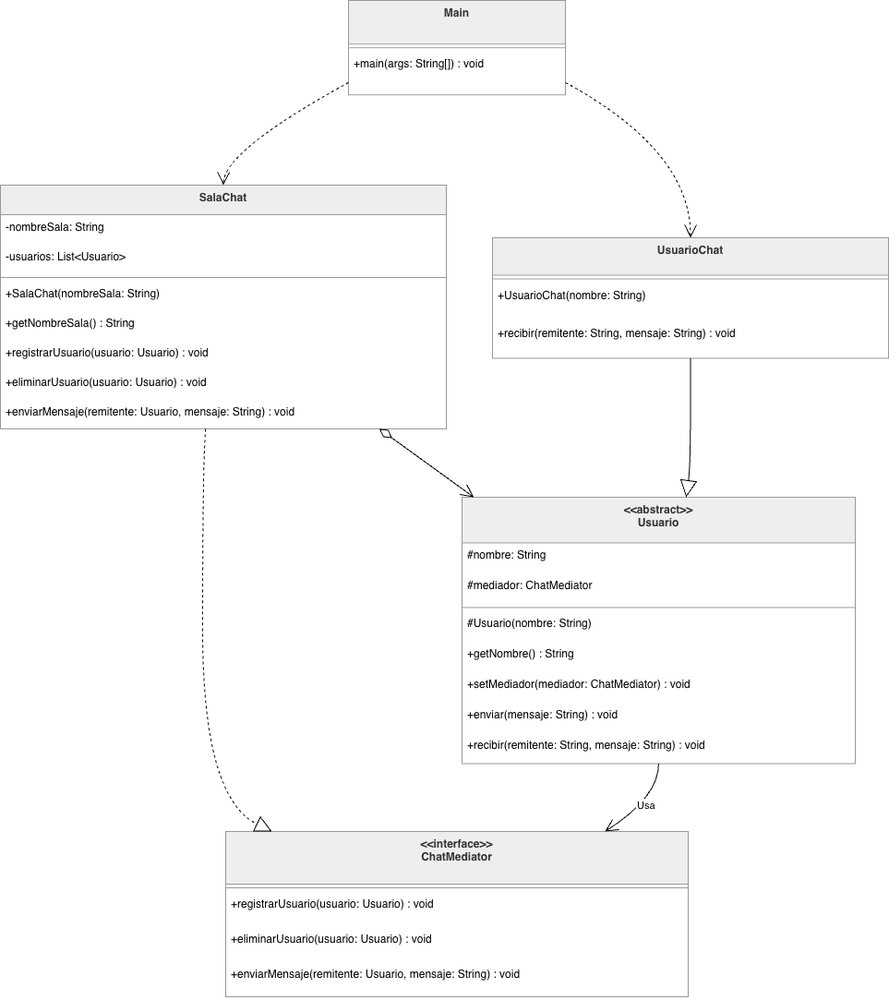

# Ejercicio 3 — Chat grupal

El escenario es un chat en grupo. Si cada usuario le escribe directo a todos los demás, el código se enreda: llega alguien nuevo o se va alguien y toca cambiar en muchos lados.

## Patrón que usamos

- **Tipo:** comportamiento
- **Patrón:** Mediator (mediador)

## Por qué comportamiento

Los creacionales son para crear objetos. Los estructurales para cómo se organizan las clases. Los de comportamiento son para cómo se hablan cuando el programa ya está corriendo.

El problema no seria crear un usuario, sino repartir mensajes sin que cada uno tenga la lista de todos. Eso cae en comportamiento.

## Por qué Mediator

En un grupo de WhatsApp no le mandas el mensaje a cada uno por aparte: lo mandas al grupo y el grupo se lo pasa a los demás. **SalaChat** hace de ese grupo. Los usuarios solo le hablan a la sala, no entre ellos.

## Clases

| Clase | Qué hace |
|-------|----------|
| `ChatMediator` | Lo que debe hacer la sala: registrar, sacar, enviar mensaje |
| `SalaChat` | La sala. Tiene la lista y reparte los mensajes |
| `Usuario` | El participante. `enviar` le pasa el mensaje a la sala |
| `UsuarioChat` | Usuario que muestra en consola lo que le llega |
| `Main` | Prueba con Carlos, Henry, Jorge, Pedro y Wolfran; Carlos sale y ya no recibe |

Cuando Henry escribe, llama `enviar`, la sala recibe y se lo manda a los otros. Henry no se recibe el mensaje a si mismo.

## Cómo correrlo

```bash
mkdir -p target/classes
javac -d target/classes src/main/java/co/edu/upb/patrones/ejercicio3/*.java
java -cp target/classes co.edu.upb.patrones.ejercicio3.Main
```

## Diagrama de clases



Archivo editable: `diagramas/ejercicio3-diagrama-clases.drawio`
